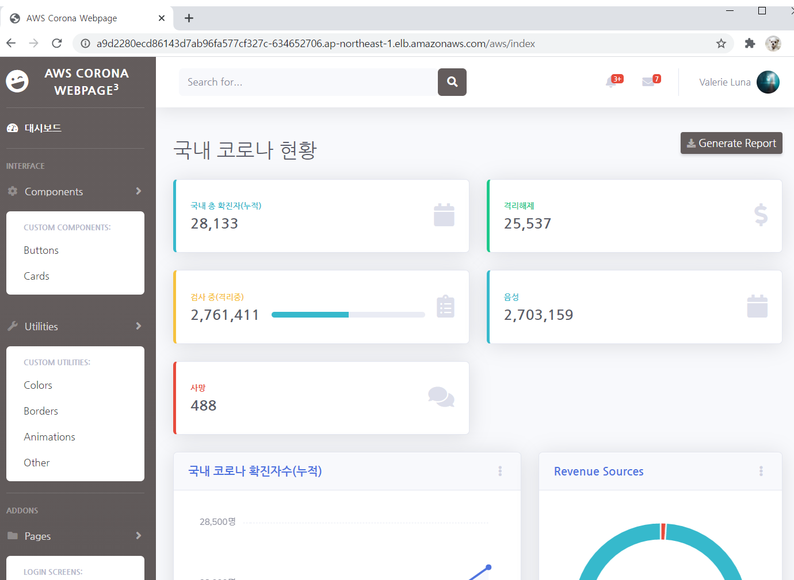
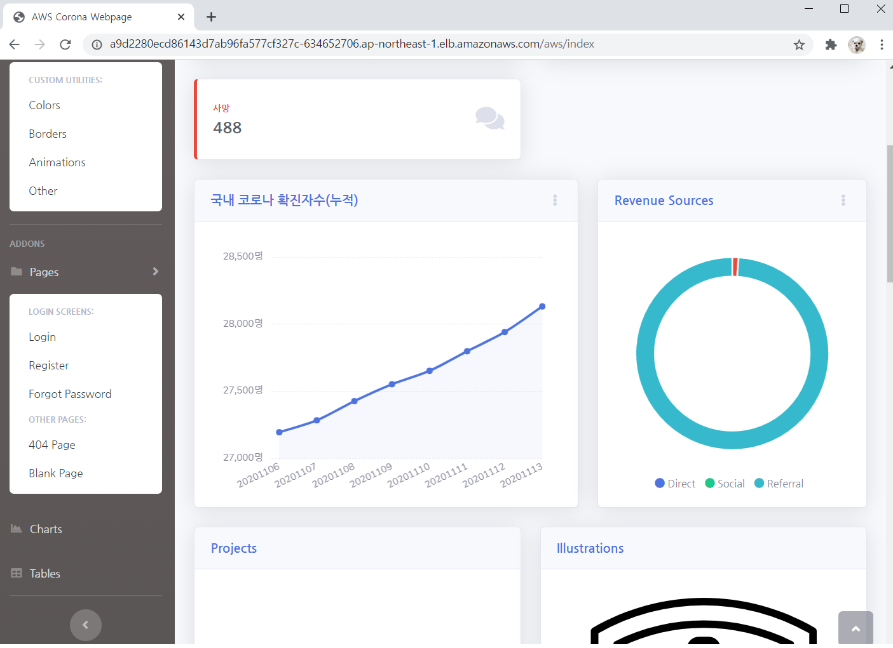

# CoronaWeb_Kubernetes

kubernetes pod에 배포하는 was 서버입니다.  
dockerfile로 자동 배포코드를 작성한 후   
codecommit 으로 git과 연동해 build 부터 deploy까지 codepipeline으로 진행합니다.  
app-deployment.yaml 파일에 service를 정의해 deploy를 할 수 있도록 합니다.  

 

